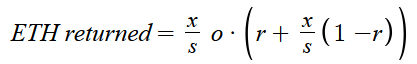

# Configuring Your Juicebox Project

## Project Details

**Project details** contains general information about how the project will be displayed on [juicebox.money](https://www.juicebox.money). Complete as much as possible—later changes to these fields will cost gas.

## Funding

**Funding** contains _Funding cycle duration_ and _Funding cycle target_.

To synchronize governance, payouts, and project reconfiguration, Juicebox projects can operate using "funding cycles". Project owners cannot change any project parameters during a funding cycle, and must instead queue them for upcoming cycles.&#x20;

Not having funding cycles allows a project owner to withdraw funds from a project at any time, and to manually trigger new funding cycles whenever they want. Your treasury strategy (including contributor payouts and fixed monthly costs) should be considered when configuring _Funding cycle duration_ and _Funding cycle target_.

- _Funding cycle duration_ determines how long these funding cycles will last, and determines how often you can withdraw your target amount.
- _Funding cycle target_ is a per-cycle target amount. This is the amount that can be withdrawn from the Juicebox each funding cycle.

> 💡 Once the _Funding cycle target_ is met, any additional funds raised are considered **overflow**. If _Allow minting tokens_ is enabled (see [Restricted Actions](#restricted-actions)), people who fund your project receive tokens which they can use to claim a portion of the overflow.

## Distribution

**Distribution** allows you to commit portions of each withdrawal to Ethereum addresses or Juicebox projects. Distribution percentages are relative to the funding target (see [Funding](#funding)). By default, non-allocated funds will be withdrawn to the project owner's wallet.

> 💡 Payouts allow for a lock date which prevents them from being changed or removed until a specific date (or until the funding cycle is reconfigured).

## Reserved Tokens

Each payment to a Juicebox project generates **tokens** which can be used to claim a portion of the **overflow** (see [Funding](#funding)). The **Reserved Tokens** section determines what percentage of these tokens goes to the payer and what percentage of these tokens goes to a designated list of Ethereum wallets and Juicebox projects.

- _Reserved tokens_ determines what percentage of token issuance is reserved.
- _Allocate reserved tokens_ determines how reserved tokens will be distributed. By default, reserved tokens go to the project owner.

> 💡 Once your project has been deployed, you can issue ERC-20 tokens on [juicebox.money](https://www.juicebox.money) which can be claimed by wallets that have already funded your project.

## Reconfiguration

> 💡 This section is only visible if a project has funding cycles (see [Funding](#funding)).

**Reconfiguration** allows project owners to set a minimum amount of time before Juicebox project reconfigurations can go into effect.

- With _No strategy_ selected, the project owner can reconfigure the project immediately before a new funding cycle begins (see [Funding](#funding)). This can make a project vulnerable to being rug-pulled by the owner.
- With _7-day delay_ selected, the project owner must submit reconfigurations at least 7 days before the start of a funding cycle. If submitted after this deadline, the reconfigurations will go into effect the following cycle.
- With _3-day delay_ selected, the project owner must submit reconfigurations at least 3 days before the start of a funding cycle. If submitted after this deadline, the reconfigurations will go into effect the following cycle.
- _Custom strategy_ allows you to create a custom strategy by entering the address of an Ethereum smart contract that implements [the FundingCycles interface](https://github.com/jbx-protocol/juice-contracts-v1/blob/05828d57e3a27580437fc258fe9041b2401fc044/contracts/FundingCycles.sol).

// TODO :: does this interface link need to be updated to v2?

## Incentives

**Incentives** consists of _Discount rate_ and _Bonding curve rate._

- _Discount rate_ is a percentage that changes the cost of issuing **tokens** over time. Each funding cycle, the amount of tokens issued per ETH will decrease by the discount rate. Generally, this will reward people who fund your project earlier.
- _Bonding curve rate_ changes the amount of overflow that each token can be redeemed for. A _Bonding curve rate_ of 60% means that tokens can be redeemed for 60% of the value they correspond to. The other 40% remains in the treasury, increasing the value of other tokens and rewarding long-term token holders.

> 💡 As tokens are redeemed for ETH, the bonding curve continuously increases the value of remaining tokens in the treasury. As a result, the total amount of ETH redeemed will be slightly higher than a flat percentage would suggest. You can calculate the effects of the bonding curve with the following formula:

> 

> In this formula, **x** represents the amount of tokens being redeemed, **s** represents the total token supply, **o** represents the current overflow, and **r** represents the bonding curve rate.


Bonding Curve 101


// TODO :: fix video embed

## Restricted Actions

**Restricted actions** allows project owners to temporarily disable key functions.

- Projects with _Pause payments_ enabled cannot receive direct payments. Projects must have this setting disabled to receive any payments.
- If _Allow minting tokens_ is enabled, the project owner can mint any amount of tokens to any address.
